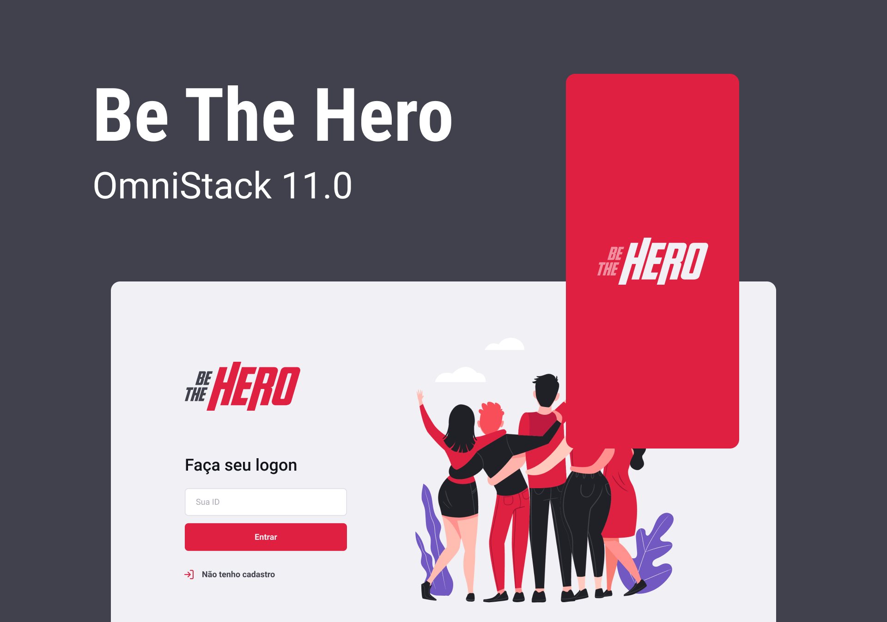
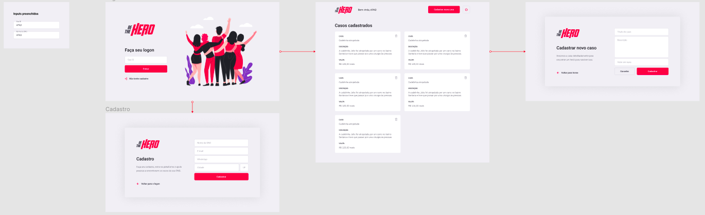
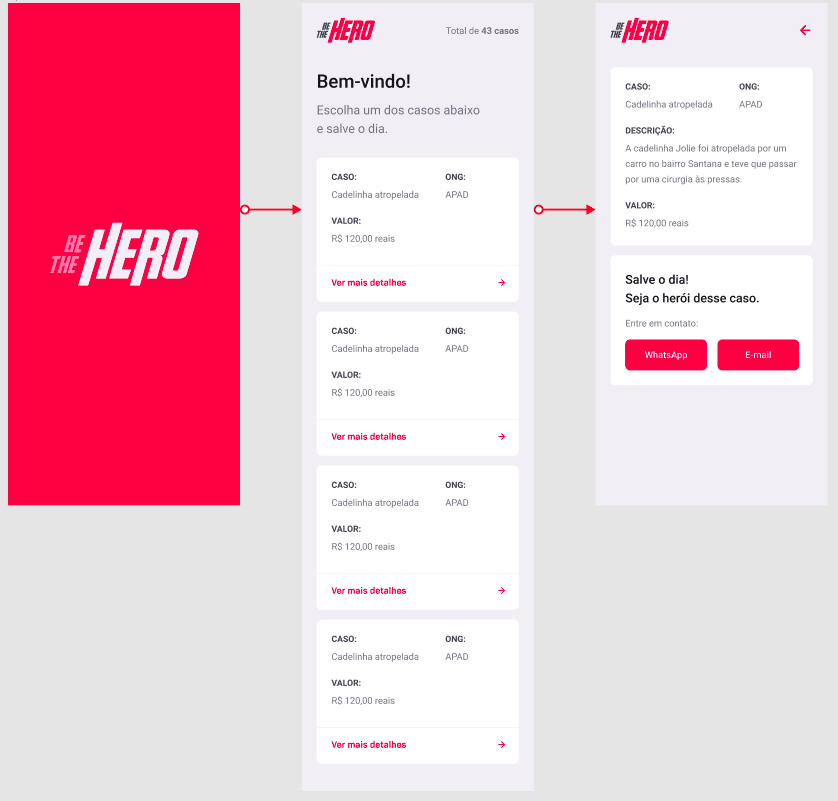

  
  <h1>Be The Hero</h1>
  <h2>Aplicação para conectar ONGs destinadas aos cuidados de animais e voluntários<h2>
  

---

A 11ª edição da Semana OmniStack trouxe como projeto uma aplicação web e mobile utilizada para unir ONGs que tem como foco animais de rua que necessitam de cuidados médicos e pessoas que desejam contribuir financeiramente no tratamento destes animais.

Durante uma semana foi desenvolvida a aplicação FullStack englobando Backend, Frontend e Mobile.

Layout da aplicação no [Figma](https://www.figma.com/file/2C2yvw7jsCOGmaNUDftX9n/Be-The-Hero---OmniStack-11?node-id=0%3A1).

## Tecnologias utilizadas
- Javascript
- React
- React Native
- Node.js
- Express
- SQLite
- Expo CLI

<table>
  <tr>
    <th><h2>Aplicação Web</h2></th>
  </tr>
  <tr>
    <th width="100%">
      
    </th>
  </tr>
   <tr>
     <th><h2>Aplicação Mobile</h2></th>
  </tr>
  <tr>
    <th width="100%">
      
    </th>
   </tr>
</table>

**&copy; [Rocketseat](https://rocketseat.com.br/)**

**Instrutor: [Diego Fernandes](https://github.com/diego3g) | CTO Rocketseat**

---

<h4 align="center">by <a href="https://github.com/JoseAAAM" target="_blank">JoseAAAM</a> </h4>
